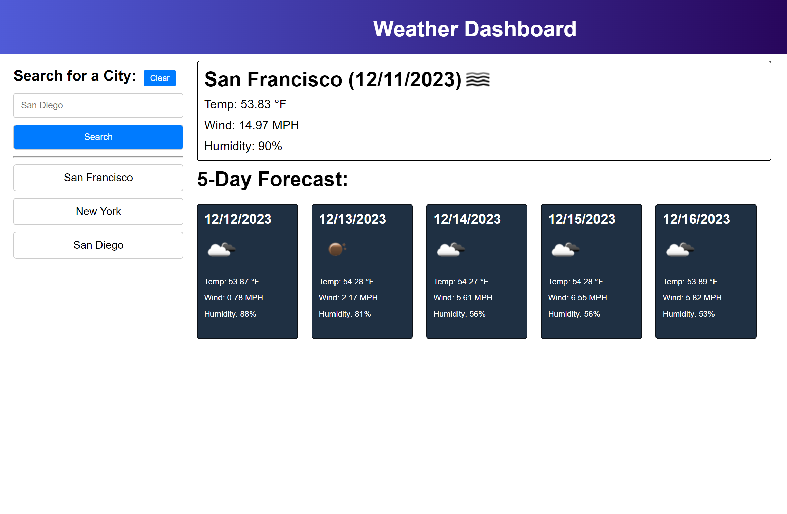

# Weather Dashboard

Welcome to the Weather Dashboard! 🌦️ This nifty web application allows you to quickly check the current weather and a 5-day forecast for any city. Stay informed about temperature, wind speed, and humidity with a clean and user-friendly interface.

## Table of Contents

- [Getting Started](#getting-started)
  - [Prerequisites](#prerequisites)
  - [How to Use](#how-to-use)
- [Features](#features)
  - [Search History](#search-history)
  - [Dynamic URL Updates](#dynamic-url-updates)
- [Technical Details](#technical-details)
  - [Technologies Used](#technologies-used)
  - [Structure](#structure)
- [Development](#development)
  - [Setting Up the Project](#setting-up-the-project)
  - [Customization](#customization)
- [Site Preview](#image-preview)
- [License](#license)

## Getting Started

### Prerequisites
- Web browser (Google Chrome, Firefox, Safari, etc.)
- Internet connection

### How to Use
1. Visit the Weather Dashboard website.
2. Enter the name of the city you want to check in the search bar.
3. Click the "Search" button or press Enter.
4. View the current weather and 5-day forecast for the selected city.

## Features

### Search History
- Track your recent searches in the sidebar for quick access.
- Clear your search history with the "Clear" button (Note: Confirmation required).

### Dynamic URL Updates
- Each search updates the URL, making it easy to bookmark or share specific city weather.

## Technical Details

### Technologies Used
- HTML5
- CSS3
- JavaScript
- jQuery
- [Day.js](https://day.js.org/) for date formatting
- [OpenWeatherMap API](https://openweathermap.org/) for weather data

### Structure
- **HTML**: Organized layout with a header, sidebar, and main section for search results.
- **CSS**: Clean and responsive design with a focus on readability and simplicity.
- **JavaScript**: Fetches weather data from OpenWeatherMap API and dynamically updates the page.

## Development

### Setting Up the Project
1. Clone the repository.
2. Open the `index.html` file in your web browser.

### Customization
- Modify the CSS in `style.css` to adjust the visual style.
- Customize the JavaScript in `script.js` for additional functionality.

## Site Preview

## License

This project is licensed under the [MIT License](./LICENSE).
